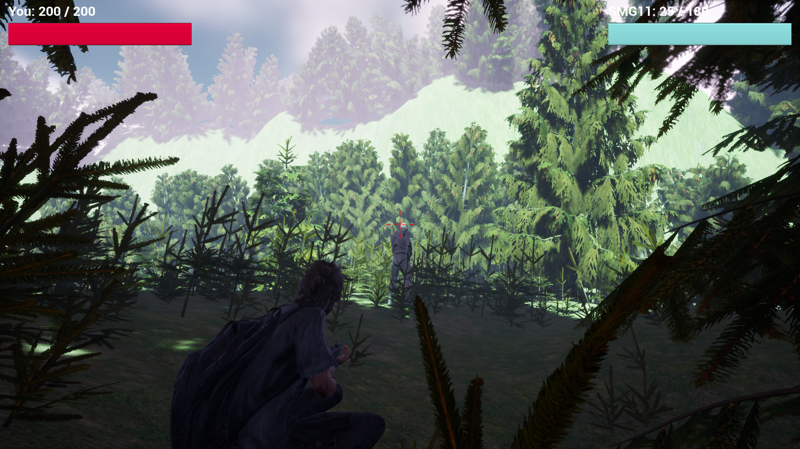
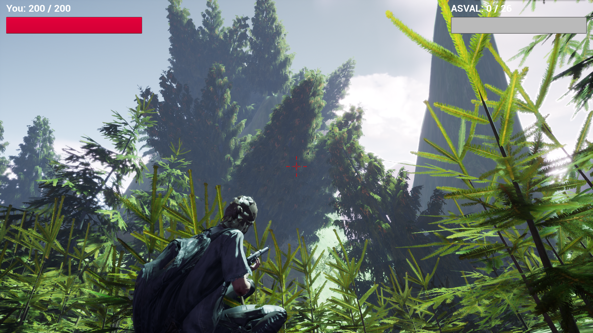
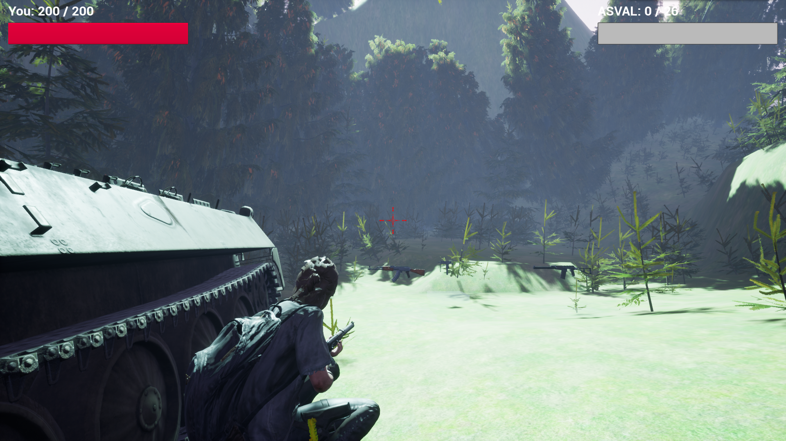

# 二级项目游戏端简介

本作是一款以末日生存为题材、3D、网络、运行于window平台上的游戏。

## 游戏下载地址

https://chyu123.top/gamemanage/public/

## 后台管理端地址

https://chyu123.top/gamemanage/public/tRNwKVcaOQ.php

## 玩法

本游戏的战斗体验，不是那种传统动作游戏的“打击感”的体验，而是一种“极限濒死感”的体验。 这种濒死感要描述的话，《美国末日》让人感受到的不是传统恐怖游戏的那种赤裸裸的恐怖，而是对整个游戏世界生存环境的敬畏和发自心底的死亡逃避的本能冲动。
绝大多数时候，玩家为了节约每一发子弹的使用，一直在不停的寻找节约子弹潜入和背刺的办法。于是，这个时候，找到一个背刺处决的机会，就成了游戏里的爽快玩点。当然，这游戏也很真实和残忍，处决动画很长，很慢。
这种极致而残酷的战斗，造就的结果就是玩家找到哪怕是游戏里的一块砖头，都能极大的提升游戏幸福度。

## 说明

本项目使用虚幻引擎开发，引擎版本为4.27。相关模型等素材来源于网络，仅用于学校作业，不参与商业用途。

## 相关仓库地址

二级项目枪战游戏后台管理系统：https://github.com/chh-yu/gamemanager

## 游戏截图

